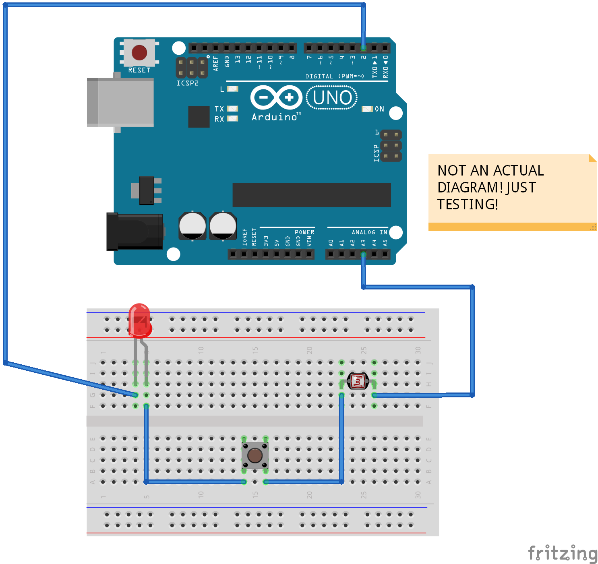

The BASE Module
===============

The BASE module is the _foundation_ for the entire Calico Home Security System.

Setup
-----

No specific setup is required for the BASE Module other than assembly the components and uploading the main project code.

For other Modules you'll be required to add additional physical components as well as modify the [/src/Properties.cpp](https://github.com/Lastrellik/Calico-Home-Security/blob/master/src/Properties.cpp) file to enable the various installed Modules.

Hardware
--------

* Arduino Uno
* Photoresistor
* 3-5V, 5mW Red Laser
* Piezo Buzzer
* Push Button
* 5x 10k ohm Resistors
* 2x Red LEDs
* Green LED

Bread Board Diagram
-------------------

(_The Base Wiring Diagram for the Calico Home Security System_)

Schematic Diagram
-----------------

(_The Base Wiring Schematic for the Calico Home Security System_)
