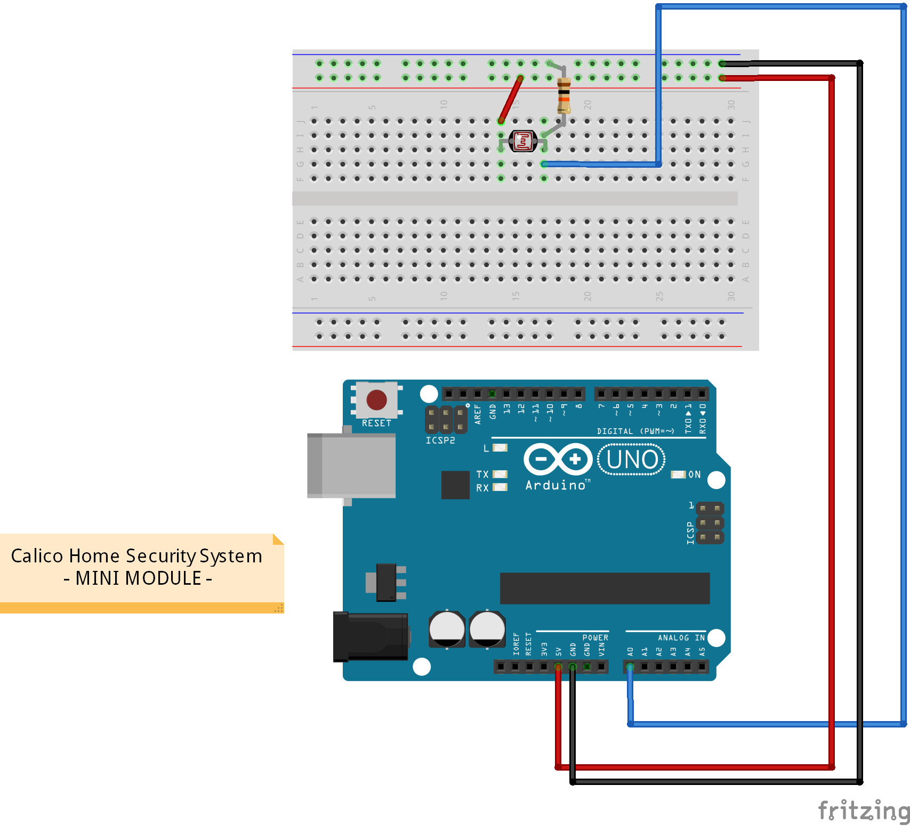
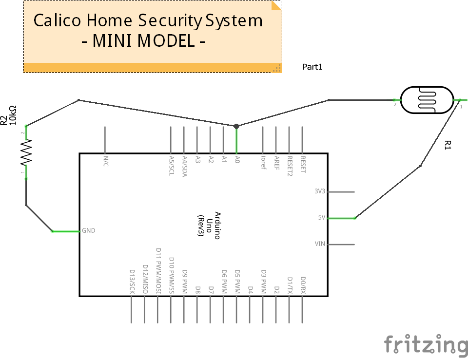

The MINI Module
===============

The MINI module is a trimmed down version of the BASE module. It functions with minimal components and is completely silent. It utilizes the Arduino's built-in LED to alert when the system has been tripped.

Hardware
--------

* Arduino Uno
* Photoresistor

Bread Board Diagram
-------------------

(_The Mini Wiring Diagram for the Calico Home Security System_)

Schematic Diagram
-----------------

(_The Mini Wiring Schematic for the Calico Home Security System_)
