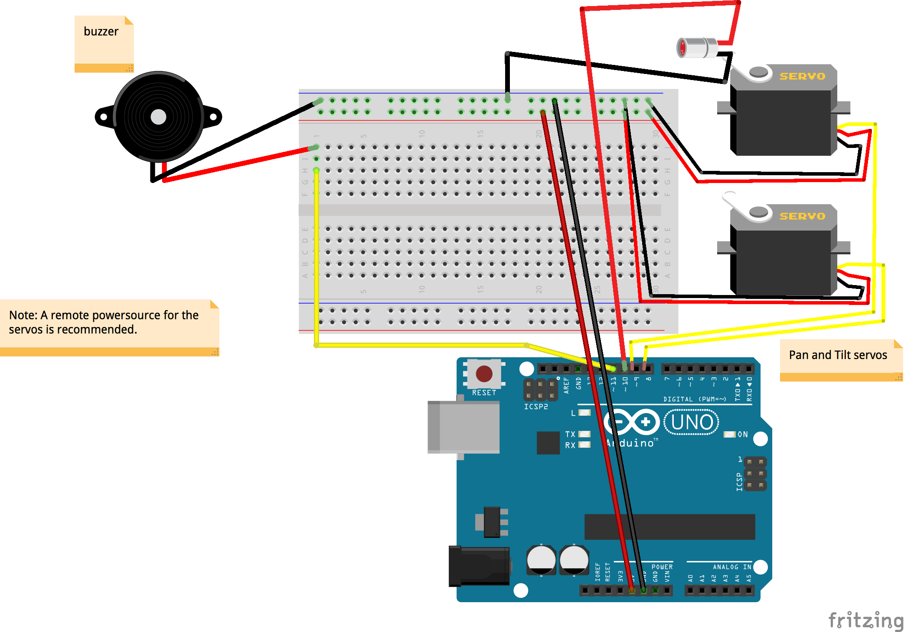

The TURRET Module
=================

The TURRET Module allows the Calico Home Security System to **fight back**! The TURRET Module adds a _fully-automated_ gun (airsoft) turret. Because of the complexities of controlling a fully-automated gun turret, an additional dedicated Arduino Uno is used to control the functionality of the turret. The Base Module's Arduino Uno communicates with the Turret's Arduino Uno through a protocol called I2C.

Parts
-----
* Additional Arduino Uno
* 2x Servos

Bread Board Diagram
-------------------

TODO: These are just PLACEHOLDERS until we get updated diagrams in here!

(_The TURRET Module Wiring Diagram for the Calico Home Security System_)

Schematic Diagram
-----------------

(_The TURRET Module Wiring Diagram for the Calico Home Security System_)

I2C Protocol
------------
I2C stands for Inter-Integrated Circuit. Many details can be read online to learn about I2C in great detail. Some example links are [Wikipedia](https://en.wikipedia.org/wiki/I%C2%B2C) and [Sparkfun](https://learn.sparkfun.com/tutorials/i2c). The bare minimum you need to know is that this is a standard protocol created in order to allow low-power, low-speed communication between two microcontrollers.

Setup
=====

TODO: This is just a PLACEHOLDER. We need to include instructions about how to load just the Turret's code onto the secondary turret controlling Arduino Uno. We may just recommend that they copy and paste some code from here or the .cpp file and paste it temporarily over top the main. That feels a little clunky, but it at least would work.

See It In Action
================

Take a look at the Turret Module doing a very basic sweep attack after the alarm has been triggered: https://youtu.be/5av2dN1TxHc
