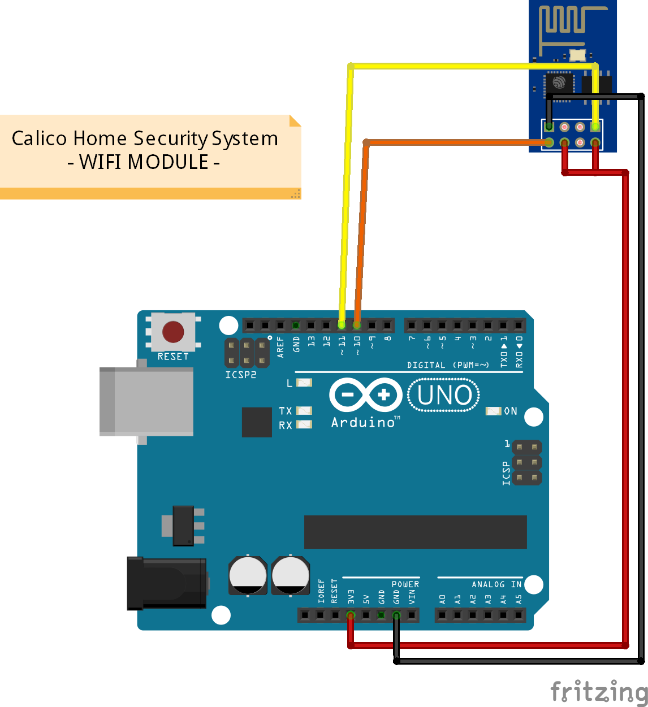
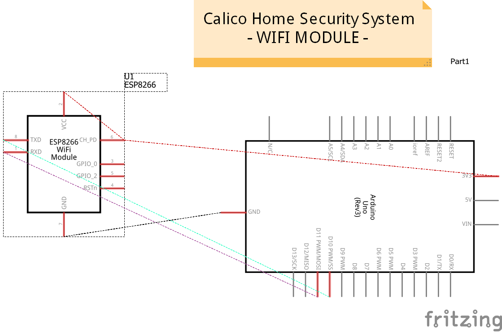
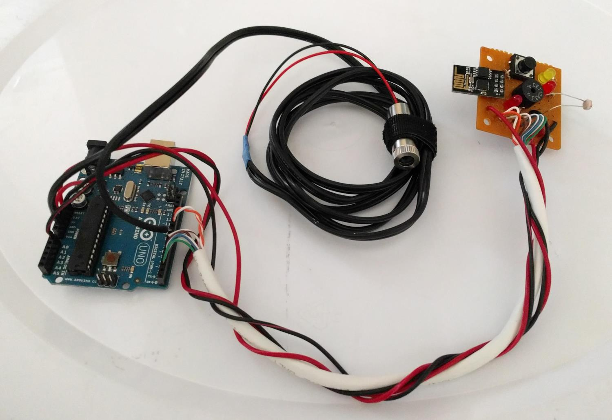
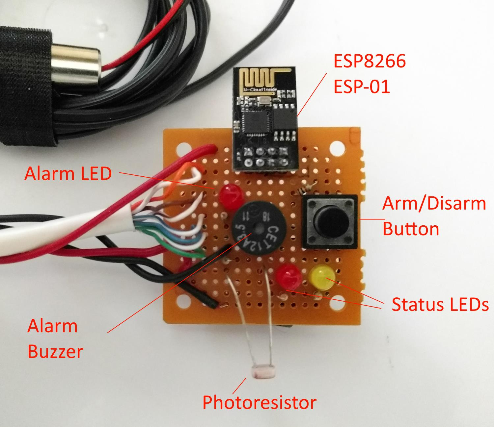

The WIFI Module
===============

The WIFI Module uses an [ESP8266](https://en.wikipedia.org/wiki/ESP8266) to add wireless functionality to the Calico Home Security System.
This wireless functionality allows you to be notified when the alarm is triggered.

* [Parts](#parts)
* [Bread Board Diagram](#bread-board-diagram)
* [Schematic Diagram](#schematic-diagram)
* [Setup Instructions](#setup)
* [Assembled Wifi Module](#assembled-wifi-module)
* [Future Development Ideas](#future-development-ideas)


Parts
-----
* **ESP8266 - ESP-01**
  - [Ebay](http://www.ebay.com/sch/i.html?_from=R40&_sacat=0&_nkw=esp8266%20esp-01&rt=nc&LH_PrefLoc=1&_trksid=p2045573.m1684): ~$5-7
    - Make sure you see where they are being shipped from. Many of these come from China so you'll be waiting weeks and weeks to get one...
  - [AliExpress](https://www.aliexpress.com/wholesale?catId=0&initiative_id=SB_20170302204802&SearchText=esp8266+esp-01): ~$1.50-2
    - If you are strapped for cash and have some time to wait to get them, you can buy them from sellers in China directly and save a few dollars.
  - Note that getting one with a "Breadboard Adapter" can be helpful for prototyping as the ESP-01 won't fit into a breadboard without it.
  - Also note that there are _many_ different models that contain as ESP8266 *(esp-01, esp-07, esp-12, esp-12E, esp-12F, NodeMCU, etc.)*. Make sure you purchase an "**ESP-01**" model. The ESP-01 model was a very commonly used one and had a small profile so I decided to go with it. In theory any of the other models would work as well though no instructions, wiring diagrams, or code are provided here.

Bread Board Diagram
-------------------

<sub>(_The WIFI Module Wiring Diagram for the Calico Home Security System_)</sub>


Schematic Diagram
-----------------

<sub>(_The WIFI Module Wiring Schematic for the Calico Home Security System_)</sub>


Assembled Wifi Module
---------------------

<sub>(_An assembled WIFI Module_)</sub>


<sub>(_Labeled details of the assembled Wifi Module_)</sub>


Setup
=====
The **ESP8266** needs a few steps before it can be ready to communicate with the Arduino. You also need to create an **IFTTT** (*IF This Then That*) account and configure a **Maker** channel and create an IFTTT **Applet**.

Once you have followed all the steps in both the IFTTT and ESP8266 Setup sections, make sure you have configured your Wifi Settings within the [/src/Properties.cpp](https://github.com/Lastrellik/Calico-Home-Security/blob/master/src/Properties.cpp) file. There you will need to enable the Wifi Module and set your wireless SSID & Password as well as enter you IFTTT Key.

* [IFTTT Setup](#ifttt-setup)
* [ESP8266 Setup](#esp8266-setup)

Future Development Ideas
======================

Initially, the Wifi module is only able to notify you when the alarm is triggered. It is also using IFTTT for that notification. We opted to go this route because it had the fewest 'moving pieces' and made it so we didn't have to maintain any other infrastructure pieces ourselves.

However, there is no reason why there couldn't be the ability to take external commands in from the ESP8266 and have those control the alarm. A common framework/standard that people use with ESP8266's and connected them to the IoT is called [MQTT](http://mqtt.org/). Utilizing MQTT would involve setting up a broker service which you call with the ESP8266 to _publish_ events. The ESP8266 can also be configured to _pull_ events from the broker as well. In theory you could publish an event through some external means (an app, a website, etc.) into the MQTT broken with a message to "Arm" the alarm. The ESP8266 would _pull_ that message and then send a message to the Arduino Uno telling it to arm.

Another potential idea would be to integrate with Amazon's [AWS IoT Platform](https://aws.amazon.com/iot/). Even another idea would be to have the ESP8266 host a very simple RESTful API which you can hit directly from an external source.

The above would have taken much more time and resources to get fully set up than time for this project allowed. We opted to use the path of least resistance even though doing so limited the functionality we could include as part of this module.

IFTTT Setup
===========

You are going to need an account at [IFTTT](https://ifttt.com/). Create an account, verify your email address, etc. before continuing.

After you have created your IFTT account, install the IFTTT app on you cell phone. IFTTT has apps for both iOS and Android. Log in on your cell phone and go through the initial setup steps on your phone.

Once you have an account and have the app installed, you need to configure the Maker channel to be part of your IFTTT account. To do this, navigate to the [Maker channel](https://ifttt.com/maker) and activate it. Once you activate that channel you should be shown a screen which contains a link similar to `https://maker.ifttt.com/use/ABCDEFG`. Copy and paste that URL into your browser.

At the top of the screen in large letters there will be a banner which says something similar to `Your key is: ABCDEFG`. Copy this key and paste it into the Properties.cpp file.

Now we need to create an Applet in IFTTT.

1. Navigate to the [My Applets](https://ifttt.com/my_applets) page in IFTTT. We are going to need to create an applet for the `Maker` channel which will send a notification to our phone.
2. Click on the `New Applet` button.
3. Set the "This" to be the Maker channel.
4. Click on the `Receive a web request` box.
5. Set the Event Name to `alarm_tripped` _(Note that you can configure this to be something different if you'd like in the Properties.cpp file. Just make sure it matches what you type in here.)_.
6. Click the `Create Trigger` button.
7. Set the "That" to be the `Notifications` channel.
8. Click the `Send a notification` box.
9. Set the Notification to be `Your alarm HOME - FRONT DOOR was TRIGGERED on {{OccurredAt}}`  _(Note you can really set this to be whatever you want. This is just an example notification that you can tweak in the future to be whatever you like it to be.)_
10. Click the `Create Action` button.
11. Click the `Finish` button.

You are now configured to use IFTTT! Make sure you have included the key in the Properties.cpp file or your notifications sent when the alarm is triggered will not function.

**Want to have some additional fun?** See what other channels you can add an also trigger when an alarm is triggered. For example, you could have it send you a text. You could have it send you a tweet or post on your Facebook page. You could log every event in a Google Spreadsheet. You could have it turn on your Phillips Hue lights. You could... you get the idea. Welcome to the connected world of IFTTT!

IFTTT Notification
------------------

This is an example of the notification that is sent to your phone from the IFTTT service:


ESP8266 Setup
============

Set ESP8266's Baud Rate to 9600
-------------------------------
By default, the ESP8266 communicates at `115200` baud which is too fast for the Arduino Uno to communicate with it using SoftwareSerial. We need to change that baud rate to `9600` which is the Arduino Uno's default baud rate. You only need follow these instructions once. This setting is persisted on the ESP-01.

1. Create a new project in PlatformIO. Call it something similar to "esp8266_setup"
2. Paste the following code into a `main.cpp` file

	```c++
	#include "Arduino.h"
	#include <SoftwareSerial.h>

	SoftwareSerial esp8266(10,11);

	void setup(){
	  Serial.begin(115200);
	  while (!Serial) { }
	  esp8266.begin(115200);
	}

	void loop(){
	  esp8266.listen();
	  if (esp8266.available() ) {
	    Serial.write(esp8266.read());
	  }

	  if (Serial.available() ){
	    esp8266.write(Serial.read());
	  }
	  delay(10);
	}
	```

3. Build then upload `main.cpp`
4. After the code has uploaded, launch the Terminal - make sure baud rate is set to `115200`
5. In the Terminal window, type `AT` and press Enter
  * _If you have issues with this step, try unplugging and plugging back in the Arduino and relaunching the Serial Monitor. Also try relaunching Atom. It appears that it sometimes just gets into a state where it doesn't fully recognize you are sending commands through it._
6. You should get back a message `OK`
7. In the Terminal window, type `AT+UART_DEF=9600,8,1,0,0` and press Enter
8. In the terminal window you should see the cursor moving and either blank or garbled characters will be displayed.
9. In the above code, change both instances of `115200` to `9600`
10. Build and upload this updated code
11. Relaunch the Terminal - make sure baud rate is set to `9600` this time
12. In the Terminal window, type `AT` and press Enter
13. You should get back a message `OK`
14. Your ESP8266 is now configured to communicate at 9600 baud. Continue on with making sure that the Arduino Uno and the ESP8266 can communicate with each other.


Make Sure Arduino and ESP8266 can communicate with each other
-------------------------------------------------------------

1. Paste the following code into a `main.cpp` file

	```c++
	#include "Arduino.h"
	#include <SoftwareSerial.h>

	SoftwareSerial esp8266(10,11);

	void setup() {
	  Serial.begin(9600);
	  esp8266.begin(9600);
	  delay(1000); // Let the module self-initialize
	}

	void loop() {
	  delay(5000);
	  Serial.println("Sending an AT command...");
	  esp8266.println("AT");
	  delay(100);
	  while (esp8266.available()){
	     String inData = esp8266.readStringUntil('\n');
	     Serial.println("Got response from ESP8266: " + inData);
	  }
	}
	```

2. Build then upload `main.cpp`
3. After the code has uploaded, launch the Terminal
4. You should see output like this every 5 seconds
	```
	Sending an AT command...
	Got response from ESP8266: AT
	Got response from ESP8266:
	Got response from ESP8266: OK
	```

5. Congratulations - your EPS8266 and your Arduino Uno are successfully communicating with each other! At this point you can go and upload the actual project's code to your Arduino.


In Case Of Emergency
-------------------

Long story... **Be careful what commands you send to the ESP8266**! Don't **EVER** run ~~`AT+IPR=9600`~~ !! This will brick your ESP8266 and you have to do a whole bunch of stuff to get it to work again including flashing a set of firmware to it... Even finding that firmware was a huge hassle. As such, just in case we need it again in the future, I've included the firmware here in the repository. In order to flash it you need to use a tool called `esptool.py`. I'm not going to give detailed instructions here on how to do it. Just be careful...
