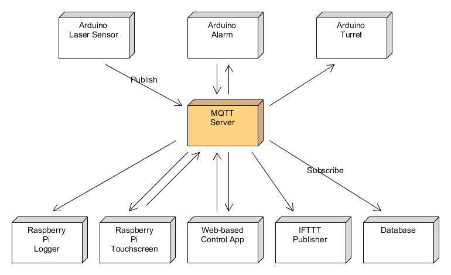

# Future Ideas

This page contains various ideas for future development of the Calico Home Security System.

* [Fully Decentralized Cloud-based Alarm Management](#fully-decentralized-cloud-based-alarm-management)
* [Web-based Control Application](#web-based-control-application)

## Fully Decentralized Cloud-based Alarm Management

Utilize MQTT to decentralize all functionality, alarming, logging, and remote control.

### What is MQTT?

"[MQTT](http://mqtt.org/) is a machine-to-machine/"Internet of Things" connectivity protocol. It was designed as an extremely lightweight publish/subscribe messaging transport." It provides a mechanism for a Publisher to push information to a specific _topic_ and for that message to be forwarded to any Subscriber who is listening to that topic. The concepts behind a publish/subscribe system are out of the scope of this document but _lots_ of information can be gained from all over the internet about it.

#### - Self Hosted MQTT Options
The advantage of self-hosting is that you are entirely in control of every aspect of the MQTT topics, data, etc. The disadvantage is you have to manage your own infrastructure.
* [Mosquitto](https://mosquitto.org/)

#### - Cloud MQTT Options
The advantage of a cloud MQTT broker is that you don't have to manage your own infrastructure. The disadvantage is that they can be costly to use. Both of the below options offer a free version that is limited in the number of hosts (publishers & subscribers) you can have as well as the number of messages you can process.
* [CloudMQTT](https://www.cloudmqtt.com/)
* [HiveMQ](http://www.hivemq.com/)

### High-level Diagram

(_This diagram was made using [UMLet](http://www.umlet.com/). The raw diagram is included in this directory for future modifications._)

### High-level Idea

The idea would be that each piece of the alarm system was standalone and was a Publisher and/or a Subscriber to various 'topics' that relate to the Alarm system. All of this could be accomplished through the use of Wifi (either built-in, ESP8266, etc.). Let me illustrate with a small narrative based on the above diagram.

The laser sensor could be running remotely on an Arduino all of its own and just constantly publishing messages to MQTT with its current status or possibly just publish when the laser line is tripped.

The Alarm could then be running on another Arduino that had a buzzer, some lights, a siren, etc. When the message is published by the laser sensor Arduino, the Alarm, who was subscribed to the topic the sensor posted to, would get a message pushed to it letting it know the laser was tripped. It could then act accordingly.

At the same time that the Alarm received the above message, the turret, also running on its own Arduino and subscribed to the same topic, received the message and has started reacting to it by looking for the perp to take him out.

Also at the same time the Raspberry Pi received the same message and has logged that it happened at the same time that the Touchscreen has changed to show a red flashing message about it being tripped. Since the Touchscreen is also a publisher, the person who tripped the laser line deactivated things via the touchscreen and his personal pin. This publishes a message to a different topic which the Alarm is subscribed to and the alarm stops sounding. This deactivation is logged to the Pi as well as written to a persistent database that keeps track of the last time that user has logged in.

So - the essence of the above narrative is that each piece works on its own and using MQTT you can asynchronously 'trigger' a whole bunch of things to happen from publishing a single message to MQTT that others can subscribe to.

## Web-based Control Application

A Web Application that is accessible from anywhere that you could see the status, arm/disarm the system, and silence a triggered alarm.

It could utilize the above MQTT strategy to publish a message that the alarm, etc. are subscribed to. Some ideas for this could be a SPA (Single Page Application) written in Angular or React. Or it could be a full-fledge web application backed by Java using SpringBoot. Maybe even both and just make it a [JHipster](https://jhipster.github.io/) application. It would need some sort of user storage probably in a database so that a user had to authenticate before it would allow you to access the system.

An anywhere-accessible web application is one of the big things in the IoT right now. The idea that you can turn you heater up from anywhere or see who is ringing your doorbell while sitting at lunch in Paris is basically a must have feature for a connected device. Adding something like this to the system would be a big benefit.
